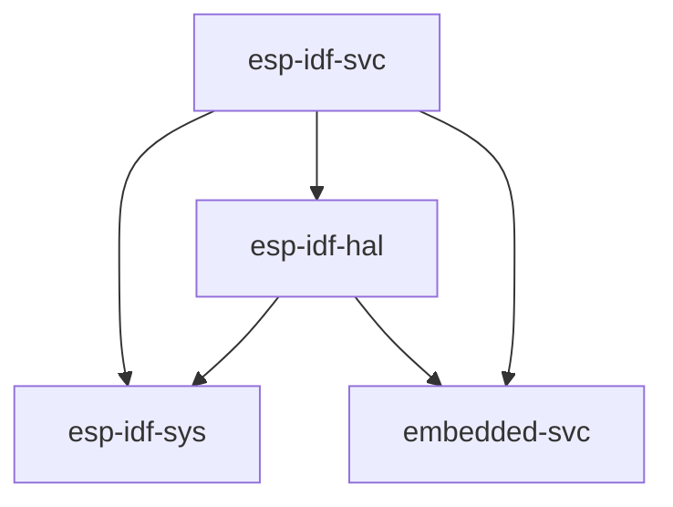

# 스탠다드 라이브러리 사용하기 (`std`)

Espressif는 [ESP-IDF][esp-idf-github]라고 불리는 C 기반 개발 프레임워크를 제공합니다. ESP32로 시작하는 모든 Espressif 칩을 지원하거나 지원할 것입니다. 이 프레임워크는 ESP8266을 _지원하지 않는다_는 점에 유의하십시오.

ESP-IDF는 그 위에 Rust 표준 라이브러리(`std`)를 구축하기에 충분한 기능을 갖춘 [newlib][newlib-env] 환경을 제공한다. 이것은 Epressif 장치에서 `std` 지원을 활성화하기 위해 취해지고 있는 접근 방식이다.

[esp-idf-github]: https://github.com/espressif/esp-idf
[newlib-env]: https://sourceware.org/newlib/

## 현재 지원되는 사항

Rust `std` 개발을 위해 지원되는 Espressif 제품은 ESP-IDF 프레임워크에서 지원하는 제품입니다. 다양한 버전의 ESP-IDF와 Espressif 칩 지원에 대한 자세한 내용은 [이 표][esp-idf-release-compatibility]를 참조하십시오.

[esp-idf-release-compatibility]: https://github.com/espressif/esp-idf#esp-idf-release-and-soc-compatibility/

`std`를 사용할 때, thread, mutex 및 기타 synchronization primitives, collections, 난수 생성, 소켓 등을 포함하여 ESP-IDF에 존재하는 많은 기능에 액세스할 수 있습니다.

### `esp-rs` 관련된 Crate들

| 리포지토리                     | 설명                                                         |
| ------------------------------ | ------------------------------------------------------------ |
| [`embedded-svc`][embedded-svc] | 임베디드 서비스들을 위한 추상화 trait들 (`WiFi`, `Network`, `Httpd`, `Logging`, etc.) |
| [`esp-idf-svc`][esp-idf-svc]   | `esp-idf` 드라이버를 사용하는 [`embedded-svc`][embedded-svc] 구현. |
| [`esp-idf-hal`][esp-idf-hal]   | `esp-idf` 프레임워크를 사용한 `embedded-hal` 및 기타 trait들의 구현. |
| [`esp-idf-sys`][esp-idf-sys]   | `esp-idf` 개발 프레임워크에 대한 Rust 바인딩입니다. 드라이버, Wi-Fi 등에 대한 raw (`unsafe`) 액세스를 제공합니다. |

앞서 언급한 crate들은 상호 의존성을 가지고 있으며, 이 관계는 아래에서 볼 수 있다.

[embedded-svc]: https://github.com/esp-rs/embedded-svc
[esp-idf-svc]: https://github.com/esp-rs/esp-idf-svc
[esp-idf-sys]: https://github.com/esp-rs/esp-idf-sys
[esp-idf-hal]: https://github.com/esp-rs/esp-idf-hal

### Standard Library(`std`)를 사용할 경우

- 풍부한 기능: 임베디드 시스템 요구사항에 네트워킹 프로토콜, 파일 I/O 또는 복잡한 데이터 구조 등의 지원과 같은 많은 기능이 필요한 경우, `std` 라이브러리를 사용한다면 광범위한 기능을 제공하여 복잡한 어플리케이션을 만들때 유용합니다.
- 이식성: `std` crate는 다양한 플랫폼과 아키텍처에서 사용할 수 있는 표준화된 API 세트를 제공하여 이식 가능하고 재사용 가능한 코드를 더 쉽게 작성할 수 있도록 합니다.
- 신속한 개발: `std` crate는 낮은 수준의 세부 사항에 대해 너무 많이 걱정하지 않고 빠르고 효율적으로 애플리케이션을 구축하는 데 사용할 수 있는 풍부한 기능 세트를 제공합니다.

